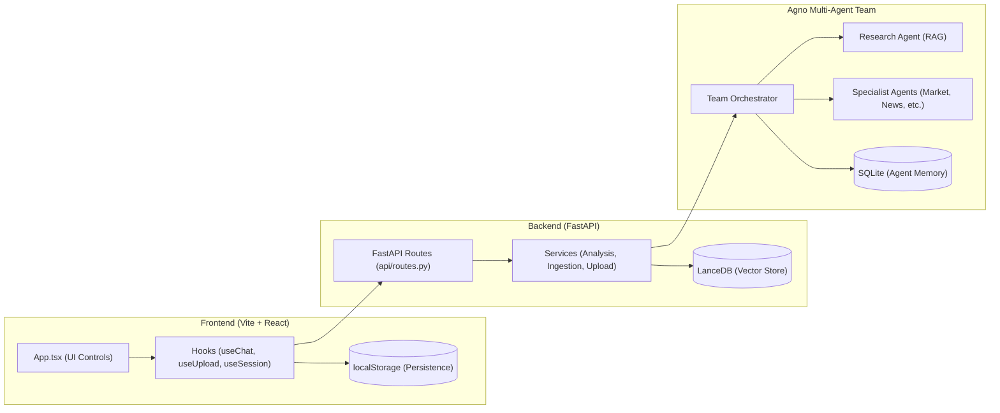
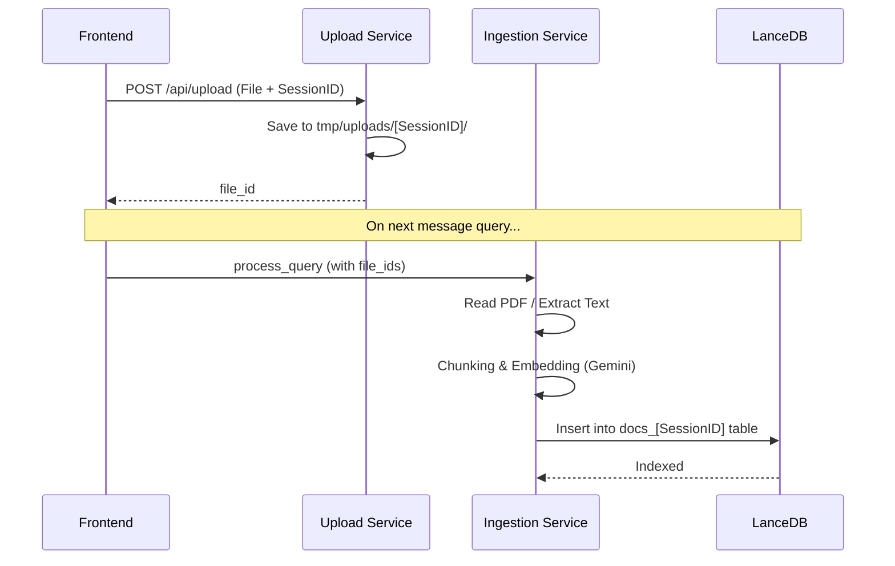
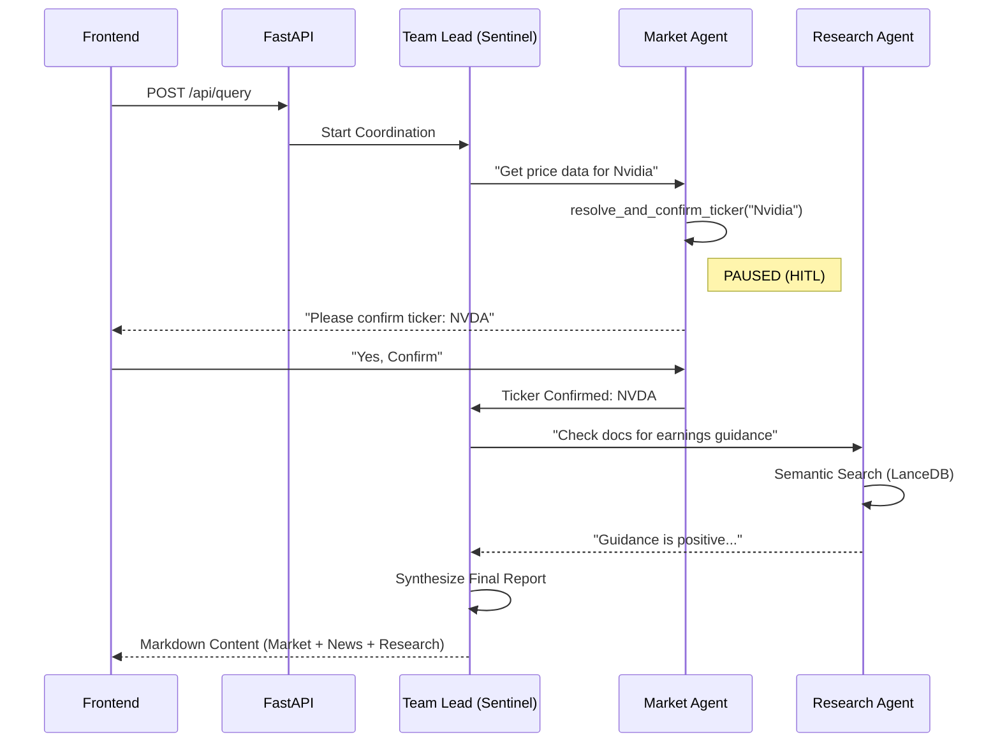

# 🛡️ Financial Sentinel

**Financial Sentinel** is an advanced AI-powered investment analysis platform that leverages a multi-agent orchestration framework to deliver deep, data-driven financial insights. By integrating real-time market data, automated news sentiment analysis, and sophisticated RAG (Retrieval-Augmented Generation) over proprietary documents, it empowers investors to make high-conviction decisions with transparency and precision.

---

### 🤝 Collaboration
This project was developed in collaboration with my colleague intern, **Meet Joshi** ([@spidermanMJ17](https://github.com/spidermanMJ17)).

---

#### **🚀 Key Features**
*   **Multi-Agent Intelligence:** Orchestrated by a central "Team Lead," specialist agents execute targeted tasks (Market Data, News, Research, Sentiment, Validation).
*   **Advanced RAG Pipeline:** Efficiently ingests, chunks, and embeds financial documents into a high-performance **LanceDB** vector store for instant retrieval.
*   **Thought Tracing:** A transparent UI that visualizes the AI’s reasoning process and agent coordination in real-time.
*   **Human-In-The-Loop (HITL):** Interactive validation steps for ticker confirmations and critical decision branches.
*   **Real-Time Data:** Live connectivity with Yahoo Finance and DuckDuckGo for up-to-the-minute market insights.

#### **🛠️ Tech Stack**
*   **Frontend:** Vite, React 19, Tailwind CSS 4, Motion (Framer), SSE.
*   **Backend:** FastAPI, Python, Agno (Multi-Agent Framework).
*   **LLMs:** Azure OpenAI (GPT-4o/Reasoning) & Google Gemini (Embeddings).
*   **Storage:** LanceDB (Vector Database) & SQLite (Agent Memory).

---

# 🗺️ System Architecture & Data Flow

This document provides a comprehensive high-level view of how the Financial Sentinel platform works, from the React frontend to the Agno multi-agent backend.

---

## 🏗️ 1. High-Level System Components

The system is split into a **Vite/React Frontend** and a **FastAPI/Agno Backend**, communicating over JSON-based REST APIs.

---

## 📄 2. PDF Ingestion Flow (The RAG Pipeline)

When you upload a PDF, it moves through a specific pipeline to become "searchable" by the Research Agent.

---

## 🧠 3. Analysis Flow (Multi-Agent + HITL)

This is the "brain" of the application where the Team Lead coordinates specialists.

---

## 💾 4. Session & Persistence Flow

How the application handles state across refreshes and resets.

| Feature | Logic |
|---|---|
| **Persistence** | [useSession.ts](file:///d:/internship/Projects/stock_market_analysis/frontend/src/hooks/useSession.ts) synchronizes the current active session, message list, and file list with `localStorage` on every change. |
| **Restore** | On page load, the frontend reads from `localStorage`. If it finds a session, it populates the UI and messages immediately. |
| **Isolation** | Each `session_id` has its own: folder in `tmp/uploads`, table in `LanceDB`, and log in [history_service.py](file:///d:/internship/Projects/stock_market_analysis/backend/services/history_service.py). |
| **Full Wipe (Exit)** | The "Exit" button calls `DELETE /api/reset`, which wipes the disk, the LanceDB tables, and SQLite memory, while the frontend clears `localStorage`. |

---

## 📁 5. Key File Index

- **Entrypoints**: [App.tsx](file:///d:/internship/Projects/stock_market_analysis/frontend/src/App.tsx) (FE), `main.py` (BE)
- **APIs**: [routes.py](file:///d:/internship/Projects/stock_market_analysis/backend/api/routes.py), [chatService.ts](file:///d:/internship/Projects/stock_market_analysis/frontend/src/services/chatService.ts)
- **Agents**: [team_orchestrator.py](file:///d:/internship/Projects/stock_market_analysis/backend/agents/team_orchestrator.py), [market_Agent.py](file:///d:/internship/Projects/stock_market_analysis/backend/agents/market_Agent.py), [research_agent.py](file:///d:/internship/Projects/stock_market_analysis/backend/agents/research_agent.py)
- **Data**: [market_tool.py](file:///d:/internship/Projects/stock_market_analysis/backend/tools/market_tool.py) (Market API), [ingestion_service.py](file:///d:/internship/Projects/stock_market_analysis/backend/services/ingestion_service.py) (PDF processing)
- **Storage**: [upload_service.py](file:///d:/internship/Projects/stock_market_analysis/backend/services/upload_service.py) (Local files), `LanceDB` (Vectors)
