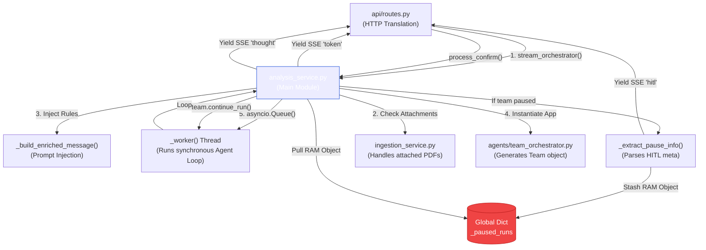

# 🧠 Component Guide: [analysis_service.py](file:///d:/internship/Projects/stock_market_analysis/backend/services/analysis_service.py)

This document isolates the [backend/services/analysis_service.py](file:///d:/internship/Projects/stock_market_analysis/backend/services/analysis_service.py) file. It is the heaviest logic file in the backend, acting as the primary orchestrator that bridges FastAPI web routes with the Agno multi-agent framework.

---

## 1. How is it Invoked?

[analysis_service.py](file:///d:/internship/Projects/stock_market_analysis/backend/services/analysis_service.py) is the immediate downstream receiver of user interactions. It is invoked purely by HTTP/SSE requests mapped in [api/routes.py](file:///d:/internship/Projects/stock_market_analysis/backend/api/routes.py).

It exposes three massive entry points depending on the type of HTTP request:
1. [stream_orchestrator()](file:///d:/internship/Projects/stock_market_analysis/backend/services/analysis_service.py#95-231) via `GET /api/stream`: Used for standard, real-time typing chat interactions.
2. [process_query()](file:///d:/internship/Projects/stock_market_analysis/backend/services/analysis_service.py#321-348) via `POST /api/query`: Used for headless, non-streaming queries.
3. [process_confirm()](file:///d:/internship/Projects/stock_market_analysis/backend/services/analysis_service.py#350-370) via `POST /api/confirm`: Used strictly as the callback when a user clicks "Yes, Confirm" on a HITL popup.

---

## 2. Execution Logic & Different Output Scenarios

The [stream_orchestrator](file:///d:/internship/Projects/stock_market_analysis/backend/services/analysis_service.py#95-231) is the most complex function. It is an asynchronous generator (`AsyncGenerator[str, None]`) that uses an `asyncio.Queue` and a background thread ([_worker()](file:///d:/internship/Projects/stock_market_analysis/backend/services/analysis_service.py#133-144)) to yield SSE frames.

| Scenario | Logic Path | Expected Output (SSE Yields to Frontend) |
| :--- | :--- | :--- |
| **User Provides a Raw Ticker Name (HITL Trigger)** | `team.run()` halts because the Market Agent tool requires a validated ticker format. Agno sets `is_paused = True`. | `yield _sse("hitl", {"ticker": "...", "run_id": "..."})`. This abruptly *ends* the stream and pauses the backend worker. |
| **Agent is "Thinking"** | Agno emits `AgentRunStarted` or internal reasoning tokens. | `yield _sse("thought", {"text": "Market Agent"})`. Renders an animated icon on the UI. |
| **Agent is Generating Text (Chunking)** | Agno emits `RunResponseDeltaContent` containing tiny byte pieces of words like `"The "`, `"price "`. | `yield _sse("token", {"text": "The "})`. Renders the words sequentially in the chat bubble. |
| **Agent Emits Full Snapshot** | Agno emits `RunResponseContent` containing the *entire* string (e.g., `"The price is $150."`). | **No UI Output.** The service detects it is a snapshot by comparing string length, calculates the diff, and only yields the difference to prevent the UI from printing `The The price is The price is...`. |
| **Standard Completion** | The generator loop exhausts normally. | `yield _sse("done", {"text": final_text})`. Signals the UI to close connections. |

### The "Enriched Message" Mechanic
Before doing *any* of the above, it executes [_build_enriched_message()](file:///d:/internship/Projects/stock_market_analysis/backend/services/analysis_service.py#69-93).
If the user attached a file, it silently alters the user's prompt (without telling the user) to inject:
`[SYSTEM: The user has uploaded X documents. Delegate to 'Financial Research Analyst' immediately.]`
This is how the system forces the LLM to adopt a RAG workflow dynamically.

---

## 3. State Management (The Local Cache)

Unlike other stateless cloud services, [analysis_service.py](file:///d:/internship/Projects/stock_market_analysis/backend/services/analysis_service.py) maintains a stateful global dictionary:
```python
_paused_runs: dict[str, dict] = {}
```
Because the HITL (Human In The Loop) process creates an HTTP disconnect (the stream ends so the UI can prompt the user), the python application would normally garbage-collect the half-finished LLM thought process. `_paused_runs` stores the entire memory footprint of the `Team` object in RAM so that [process_confirm()](file:///d:/internship/Projects/stock_market_analysis/backend/services/analysis_service.py#350-370) can pull it back out and resume EXACTLY where it left off.

---

## 4. Local Architecture Diagram


