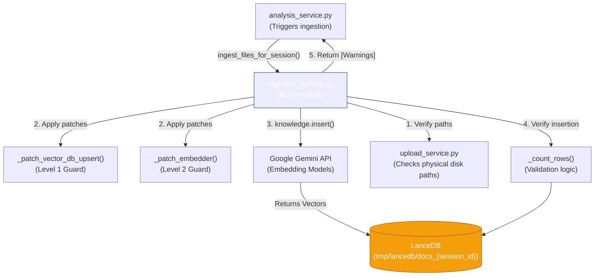

# 📚 Component Guide: [ingestion_service.py](file:///d:/internship/Projects/stock_market_analysis/backend/services/ingestion_service.py)

This document isolates the [backend/services/ingestion_service.py](file:///d:/internship/Projects/stock_market_analysis/backend/services/ingestion_service.py) file to explain specifically how it is invoked, the logical conditionals it handles, and exactly what it outputs.

---

## 1. How is it Invoked?

[ingestion_service.py](file:///d:/internship/Projects/stock_market_analysis/backend/services/ingestion_service.py) is **not** a persistent background worker. It is invoked purely "Just-In-Time" (JIT) during an active chat request.

**The Invocation Chain:**
1. User drops a PDF via the UI.
2. The UI uploads it to `/tmp/uploads/{session_id}` (saving a physical file). *The ingestion service DOES NOT run here.*
3. The User sends their *next* chat message. The UI bundles the `file_id` into the request.
4. [analysis_service.py](file:///d:/internship/Projects/stock_market_analysis/backend/services/analysis_service.py) receives the request, sees the `file_id`, and actively calls:
   ```python
   # Inside analysis_service.py
   ingestion_warnings = await loop.run_in_executor(
       None,
       ingestion_service.ingest_files_for_session,
       session_id, attachments, session_kb,
   )
   ```

---

## 2. Execution Logic & Different Output Scenarios

The main entry point is [ingest_files_for_session()](file:///d:/internship/Projects/stock_market_analysis/backend/services/ingestion_service.py#207-292). It handles several distinct branches depending on the state of the system and the quality of the uploaded PDF.

| Scenario | Logic Path | Expected Output String (Internal) / Behavior |
| :--- | :--- | :--- |
| **File Already Indexed** | `upload_service.is_indexed(file_id)` returns `True`. | Loops immediately. Logs "already indexed". **Returns `[]` (No warnings).** |
| **File Missing from Disk** | `upload_service.get_file_path()` returns `None`. | Skips processing. **Returns warning string**: `"File {id} not found..."` |
| **Corrupted / Encrypted PDF** | `knowledge.insert(reader)` throws an exception (e.g., PyMuPDF error). | Service catches error. Suggests it may be password protected. **Returns warning string.** |
| **Image-Only (Scanned) PDF** | `knowledge.insert` runs successfully, but [_count_rows()](file:///d:/internship/Projects/stock_market_analysis/backend/services/ingestion_service.py#184-201) returns `0`. | Identifies no text was extracted (likely a scan). **Returns warning string**: `"appears to be an image-based... PDF"` |
| **Standard Text PDF** | `knowledge.insert` extracts text. **The "Gemini Guard" monkeypatch silently drops any blank pages.** Valid text is vectorized. | Marks file as indexed via `upload_service.mark_indexed()`. Logs success. **Returns `[]` (No warnings).** |

### Output Types
The service primarily outputs:
1. **Side Effects**: Vector chunks written to LanceDB `docs_{session_id}`.
2. **Boolean State Change**: Flags the `file_id` as indexed in the upload tracker so it is never double-processed.
3. **Array of Strings**: Returns a list of human-readable warnings to [analysis_service.py](file:///d:/internship/Projects/stock_market_analysis/backend/services/analysis_service.py), which eventually injects them into the system prompt so the LLM knows *why* a file failed.

---

## 3. The "Gemini Guard" (Monkey-Patching)

The most complex part of this file is the runtime patching.
Gemini's embedding API violently rejects `""` (empty strings) with a `400 INVALID_ARGUMENT` error. Because the standard Agno `PDFReader` extracts cover pages as empty strings, we patch the database and the embedder at runtime using [_patch_vector_db_upsert(knowledge)](file:///d:/internship/Projects/stock_market_analysis/backend/services/ingestion_service.py#58-120) and [_patch_embedder(knowledge)](file:///d:/internship/Projects/stock_market_analysis/backend/services/ingestion_service.py#126-178). 

This ensures that no matter what text the reader generates, an empty string will NEVER be sent over the wire to Google.

---

## 4. Local Architecture Diagram


