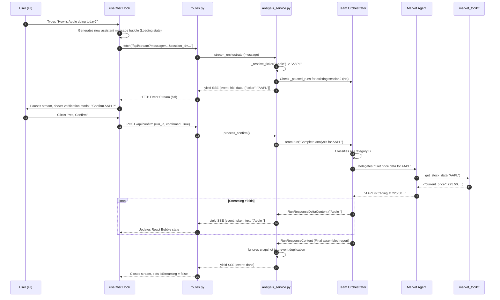
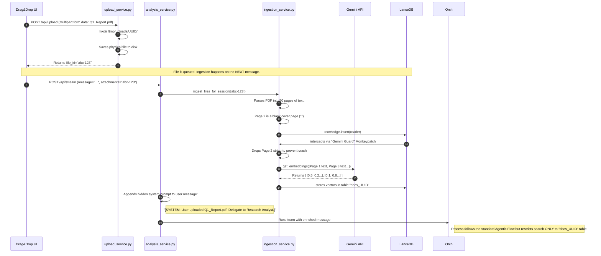

# 🌊 Financial Sentinel: Comprehensive Data Flow

This document maps the exact, step-by-step flow of data through the system over time. While the Architecture Diagram shows *what* the system is, these diagrams show *how* it operates chronologically.

---

## 🚦 Flow 1: The Standard Stock Analysis Request (Category B)

This maps the journey of a user asking "How is Apple doing today?".



---

## 📄 Flow 2: The Document Upload & RAG Ingestion (Category C)

This maps what happens when a user drops a massive SEC 10-K filing onto the chat window.



---

## 🛠️ Tracing the Data Shapes

To truly understand the flow, you must understand the shape of the data at each boundary.

### 1. The React [Message](file:///d:/internship/Projects/stock_market_analysis/frontend/src/services/chatService.ts#144-147) Type (Frontend)
```typescript
{
  id: "uuid-4",
  role: "user" | "assistant",
  content: "Actual text rendered on screen",
  isStreaming: true,
  sources: [...] // If citations exist
}
```

### 2. The HTTP API Request Body
```json
{
  "message": "Analyze Apple",
  "session_id": "user_session_99",
  "attachments": ["file_id_1"]
}
```

### 3. The Enriched Prompt (Backend Internal)
```text
[SYSTEM: The user has uploaded 1 document(s) indexed in the knowledge base: 'Q1_Report.pdf'. This is a DOCUMENT RESEARCH query (Category C or B+C). Delegate to 'Financial Research Analyst' immediately. The documents ARE available — do NOT say they are missing.]

Analyze Apple.
```

### 4. The Agno Raw `TeamMemberAgentStarted` Event
```python
RunEvent(
    event="TeamMemberAgentStarted",
    agent="market_Agent",
    team="Financial Sentinel",
    content=None
)
```

### 5. The Transformed SSE Event Stream (Sent to Browser)
```http
event: thought
data: {"text": "market_Agent", "event_type": "AgentRunStarted"}

event: token
data: {"text": "Apple"}

event: token
data: {"text": " is trading at "}
```

### 6. The SQLite Persistence Schema ([history_service.py](file:///d:/internship/Projects/stock_market_analysis/backend/services/history_service.py))
```json
{
  "session_id": "user_session_99",
  "messages": [
    {"role": "user", "content": "Analyze Apple", "timestamp": "2024-01-01T..."}
  ]
}
```
