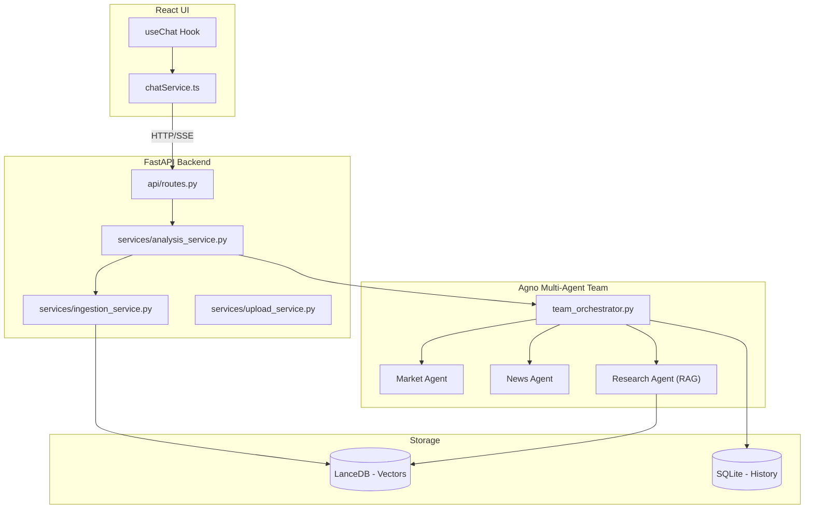

# 🚀 Financial Sentinel: Developer Handover Guide

Welcome to the project! This guide is designed to help you understand the "plumbing" of the Financial Sentinel platform so you can maintain it and add cool new features.

---

## 🏗️ 1. Architecture Overview

The system follows a classic **Frontend-Backend** split, with the backend doing the heavy lifting using an **Agentic AI** framework.

### The Stack:
- **Frontend**: React (Vite) + Tailwind CSS.
- **Backend**: FastAPI (Python).
- **Agent Framework**: [Agno](https://agno.com) (formerly Phidata).
- **Database**:
  - **Vector Store**: LanceDB (Per-session isolation).
  - **Memory**: SQLite (Agent chat history).
- **Embeddings**: Google Gemini (`gemini-embedding-001`).
- **Models**: Mixed (Azure OpenAI / Gemini).

### System Diagram:

---

## 📥 2. The Request Lifecycle (Input to Backend)

Understanding how a user's message turns into an AI response is key.

### Step A: The Frontend Trigger
When a user types a message and hits Enter, the [useChat.ts](file:///d:/internship/Projects/stock_market_analysis/frontend/src/hooks/useChat.ts) hook is triggered.
1. It calls `chatService.streamMessage`.
2. This creates a standard `fetch` request to `GET /api/stream`.
3. It uses **SSE (Server-Sent Events)** to receive tokens in real-time.

### Step B: The Gateway (API Layer)
In [api/routes.py](file:///d:/internship/Projects/stock_market_analysis/backend/api/routes.py), the [stream_query](file:///d:/internship/Projects/stock_market_analysis/backend/api/routes.py#15-48) function picks up the request.
- It extracts the [message](file:///d:/internship/Projects/stock_market_analysis/backend/services/analysis_service.py#69-93), `session_id`, and any `attachments` (file IDs).
- It calls the `analysis_service.stream_orchestrator`.

### Step C: The Coordinator (Analysis Service)
This is the central hub. Located in [services/analysis_service.py](file:///d:/internship/Projects/stock_market_analysis/backend/services/analysis_service.py), it:
1. **Ingest Files**: If there are attachments, it calls `ingestion_service` to index them.
2. **Build Context**: It wraps your message with "Enriched" system instructions (Category B, C, etc.).
3. **Run the Team**: It kicks off the Agno Team run and yields tokens back to the frontend.

---

## 📄 3. PDF Ingestion & RAG Pipeline

If the user uploads a PDF, it goes through this pipeline before the agents can "read" it.

1. **Upload**: [upload_service.py](file:///d:/internship/Projects/stock_market_analysis/backend/services/upload_service.py) saves the file to a temporary folder name after your `session_id`.
2. **Ingestion**: [ingestion_service.py](file:///d:/internship/Projects/stock_market_analysis/backend/services/ingestion_service.py) reads the PDF.
   - **Gemini Guard**: We have custom "monkey-patches" to block empty strings from hitting the Gemini embedding API (which would cause a 400 error).
3. **Storage**: Chunks are stored in [LanceDB](file:///d:/internship/Projects/stock_market_analysis/backend/tmp/lancedb). Every session gets its **own table** (`docs_{session_id}`), ensuring your data never leaks to another user.

---

## 🧠 4. Agentic Workflow (The Brain)

We use a **Coordinator Mode**. The "Team Lead" (Sentinel) decides who does what.

### Classification Logic
In [agents/team_orchestrator.py](file:///d:/internship/Projects/stock_market_analysis/backend/agents/team_orchestrator.py), the Team Lead follows these rules:
- **Category A**: Just Chat (No tools).
- **Category B**: Stock Query → Delegate to Market & News agents.
- **Category C**: PDF Query → Delegate to Research Analyst (RAG).
- **Category B+C**: Combined → Cross-reference live data with PDF insights.

### Specialist Agents:
- **Market Data Agent**: Fetches real-time prices and technicals (RSI, SMA).
- **News Agent**: Scrapes the latest headlines.
- **Sentiment Analyst**: Scores the news as Bullish/Bearish.
- **Research Analyst**: Searches the RAG knowledge base (LanceDB).
- **Validator Agent**: Ensures the price action and news sentiment align reasonably.

---

## 🛠️ 5. Future Development: How to...

### How to add a new Specialist Agent:
1. Create a new file in `backend/agents/` (e.g., `macro_agent.py`).
2. Define the Agent with its own instructions and tools.
3. Import and add it to the `members` list in [agents/team_orchestrator.py](file:///d:/internship/Projects/stock_market_analysis/backend/agents/team_orchestrator.py).
4. Update the `_SENTINEL_INSTRUCTIONS` to tell the Team Lead when to delegate to this new agent.

### How to add a new Tool:
1. Add a Python function with clear type hints and a docstring (Agno uses these for LLM prompting).
2. Add it to the `tools` list of the relevant agent.

---

**Happy Coding!** If you have questions, check the [README.md](file:///d:/internship/Projects/stock_market_analysis/README.md) for more structural details.
