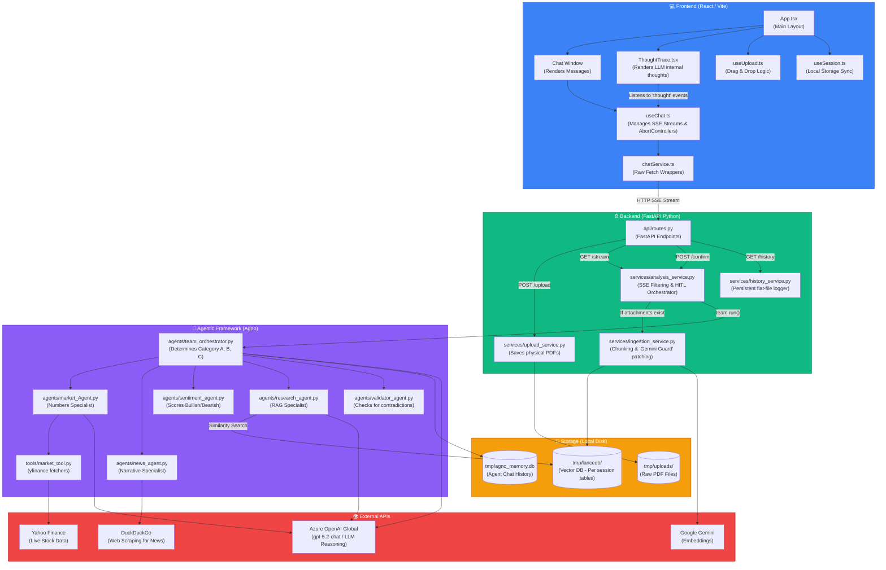

# 🗺️ Financial Sentinel: Full System Architecture

This document provides a highly detailed, end-to-end visual map of the entire codebase. Use this diagram to trace the execution flow of a prompt from the user's browser all the way down to the LanceDB vector store and the Agno Agent LLM calls.

## The End-to-End Workflow Diagram

### 🔍 How to Read This Diagram
1. **The User Input (`SvcChat -> Routes`)**: A user types a message. The request flows from the React hooks over an SSE connection to the FastAPI [routes.py](file:///d:/internship/Projects/stock_market_analysis/backend/api/routes.py).
2. **The Orchestrator (`SvcAnalysis`)**: The heartbeat of the app. It checks for PDFs (routing to `SvcIngest`), enriches the prompt, and hands control to the `Team`.
3. **The Multi-Agent Web (`Agents`)**: The `Team Lead` uses its strict instructions to classify the prompt and delegate out to its specialist members.
4. **Data Sourcing (`External`)**: The agents use tools to break out to the real world — querying Yahoo Finance, DuckDuckGo, and pulling from the local `LanceDB` vector store.
